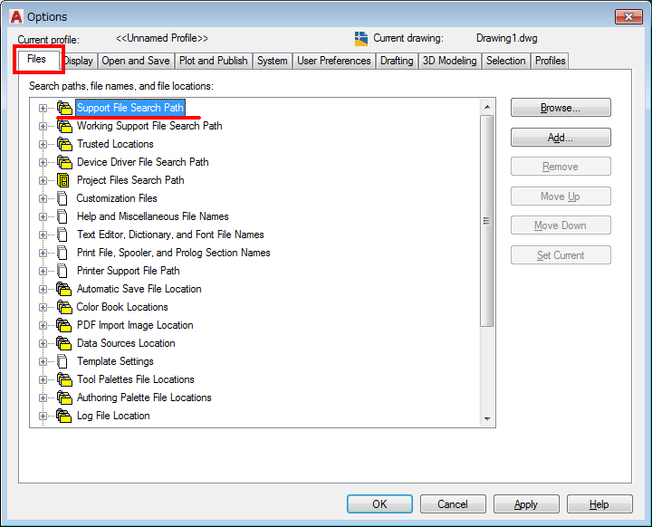
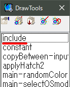
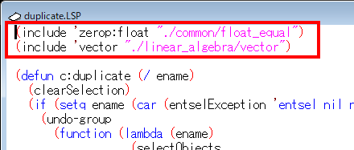
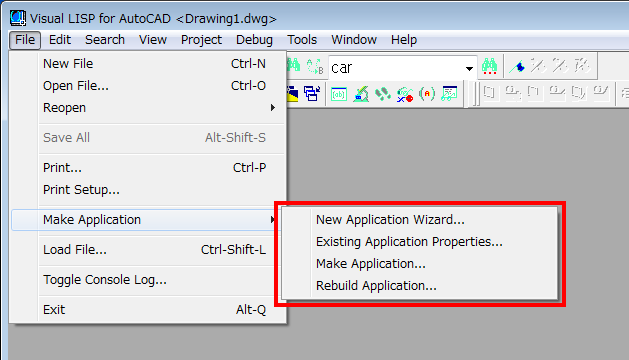

# include


# INTRODUCTION

This library system consists of several functions including the include function, and provides a mechanism for loading the external function files required in the AutoLISP development environment. Then, the list of loaded functions can be created as a Visual LISP project file or a [VLX application] definition file. The final purpose is to create a [VLX application] using these.

AutoLISP has a load function that allows you to load the required function from another file. But it's a simple operation, so you have to keep track of which files are loaded. Therefore, a system such as a library that loads required functions efficiently and automatically cannot be used in the original AutoLISP execution environment. Here, the include function that extends the load function is defined to build the library system. The main difference between the include function and the load function is that the already loaded file is remembered and unnecessary loading is not performed.

In addition to an existing library, which is based on the include function, you can create your library of your own reusable functions by organizing them in a separate folder from the program you're writing, in the same way.

While using the include function automatically loads the function, it becomes difficult to know which function is the target of loading. Therefore, it becomes difficult to use the program in an environment other than the AutoLISP execution environment used for development. From this, it is necessary to finally combine the program you have written and the functions of the necessary libraries into one [Separate-namespace VLX application]. By using [Separate-namespace VLX Application], it is possible to make the program easy to handle with one file and operate without interfering with AutoLISP execution environment of other AutoCAD users.

You can write the list of function files that the include function has loaded and remembered to the Visual LISP project file format. This can be used as a resource in the application definition file when finishing your program as a "Separate-namespace VLX application". You can also directly create a application definition file for the development environment of Visual Studio Code where Visual LISP projects cannot be used. For that, it requires a little work using the load-file and resource-file functions in addition to the include function. This corresponds to manually editing the application definition file in Visual LISP.

# ABOUT LICENSE

The function source code is a MIT license. The MIT license is one of the open source software licenses that has few restrictions.

The outline of the MIT license is translated into this case as follows.
* No warranty!
* Anyone can use the source code of this function for free. You can freely distribute and change the source code, including commercial use, and create programs that use it.
* When redistributing or changing the source code of this function, the following copyright notices already included in this must not be erased. Also, when you try to distribute your program created using this, please display the following three copyright notice lines in appropriate place where we can confirm, such as another file for the license display that is included.
```
Copyright (c) 20xx manual chair japan
Released under the MIT license
https://opensource.org/licenses/mit-license.php
```

# Preparation of library system

## Set Support File Search Path

1. Set [Support File Search Path] of AutoCAD.

Set the path to the library. You can put the libraries that depend on the include function or libraries that you want to create on your own wherever you want. However, for the path up to that, please set the [Support file search path] of AutoCAD. This setting can be set from the [Files] tab of the dialog displayed by the OPTIONS command of AutoCAD.


 
Depending on the version of AutoCAD, include the folder in the [trusted Location].

## Define include and other functions

2. Load include function in AutoLISP development environment of AutoCAD.

The include function loads a function from a library. In advance, load this function into the development environment from the **include-lib.LSP** file from acaddoc.LSP etc.


When this file is loaded, a series of functions are defined, including the include function and functions that writes the list of files loaded using include function. Also, the global variable \*DrawingLevelEnviromet\* is set to T.

This completes the library system settings. The process of program development is explained below. The process can be divided into two types depending on whether you are using  Visual Studio Code (CASE 1) or Visual LISP (CASE 2) . In the case of Visual LISP, it is easier to develop programs using Visual LISP projects. 

# Usage - CASE 1: Visual Studio Code development environment

Although it is the case of the Visual Studio Code development environment, it is also possible with Visual LISP without using the project file.

For Visual Studio Code development environment where Visual LISP project cannot be used, the definition file of [VLX application] is automatically created directly. For that, a little work is required using the load-file and resource-file functions. This corresponds to manually editing the application definition file in Visual LISP.

## STEP 1 - Develop a program

### Preparing LISP file for project loading

1. Prepare a LISP file for project loading using the load-file and resource-file functions.

Prepare a LISP program for loading corresponding to the Visual LISP project. Here is the code that loads a set of program files for your project. In that case, use the load-file function instead of the load function. 

```lisp
(load-file "./project/DrawTools")
```

The load-file function receives a single string argument representing the file name and loads the LISP program file when it is called as in the load function, but remembers the loaded file. This is used when outputting the application definition file. The file extension is not required, which is the same as the load function.

Use the resource-file function for programs other than LISP program files that use DCL files or TXT files and include them as resources in the final [VLX application]. 

```lisp
(resource-file "./resource/data.txt")
```

This function takes one argument, a string that represents a filename, and when called, only records the file and has nothing to do with running your program. The recorded file is output to the application definition file. Please specify the resource specified in the resource-file function including the file extension. Describe this declaration in either the project loading file or the file loaded from it.

### Include Function For Separate-namespace VLX Applications

2. Register the include function for [Separate-namespace VLX application] at the top of the project loading file using the load-file function.

When the program is finally created as [Separate-namespace VLX applications], the library functions are loaded from within the resource. In this case, use an include function that target resources different from the include function used during development. This function is defined in **include.lsp**.

Register this file at the top of the project file of the program you are creating, so that it is included in the [Separate-namespace VLX applications]. This include function skips the definition while \*DrawingLevelEnviromet\* is T even if the file is registered in the project loading file, and is activated only in the [Separate-namespace VLX applications].


### Include Statement

3. Write an include statement for the required library function in your program.
4. Connect to AutoCAD from Visual Studio Code and use the project loading file to load the file.
5. Repeat the test to complete your program.

Complete your program while loading library functions in time with the include function. From Visual Studio Code, you can load the set of project files by connecting to AutoCAD by specifying the project loading file.

If you write the following statement in your program, the file containing the library functions will be loaded from the library as needed.

```lisp
(include 'default "./common/default")
```

The first argument of the include function is the name of the function that requires it, and the second argument is the file-name in which the function is defined. In the above example, if the default function is not defined, it means to load the "./common/default" file. The file name is described as a relative path from the AutoCAD [Support File Search Path].


## STEP 2 - Creating Separate-namespace VLX application

### Write of application definition file

1. Write the application definition file using the createPRV function.

After your program is complete, use the createPRV function to write an application definition file for creating [Separate-namespace VLX application]. This work writes out what the include, load-file, and resource-file functions remember during the development process, so you may have registered unnecessary files during trial and error. Therefore, please reset the AutoLISP execution environment once, then load your program again, and do the operation without unnecessary items. When you execute the createPRV function from [Console], the dialog to save the file appears. Please specify the file name and save.

```lisp
> (createPRV nil nil) ⏎

; An application make file has been created.
; F:\VisualLISP\project\DrawTools\DrawTools.prv
```
The createPRV function has two arguments. First, specify the temporary file folder with strings. If you specify nil, it will be "temp". The second argument specifies the output destination folder of [VLX application]. If nil, it is created in the same location as the application definition file.

### Creating a VLX application

2. Create [VLX application] from AutoCAD command MAKELISPAPP.

Please check whether the contents of the output application definition file include your project file and resource file.

Make or rebuild [VLX application] by specifying this application definition file from AutoCAD command MAKELISPAPP.

After resetting the AutoLISP execution environment again, load the created [VLX application] and test if it works properly.

# Usage - CASE 2: Visual LISP development environment

## STEP 1 - DEVELOP PROGRAMS

### Include Function For Separate-namespace VLX Applications

1. Register the include function for [Separate-namespace VLX applications] at the top of your project.

When the program is finally created as [Separate-namespace VLX applications], the library functions are loaded from within the resource. In this case, use an include function that target resources different from the include function used during development. This function is defined in **include.lsp**.

Register this file at the top of the project file of the program you are creating, so that it is included in the [Separate-namespace VLX applications]. This include function skips the definition while \*DrawingLevelEnviromet\* is T even if the file is registered in the project, and is activated only in the [Separate-namespace VLX applications].



### Include Statement

2. Write an include statement for the required library function in your program.
3. Load the project from Visual LISP and run the program.
4. Repeat the test to complete your program.

Complete your program while loading library functions in time with the include function. If you write the following statement in your program, the file containing the library functions will be loaded from the library as needed.

```lisp
(include 'default "./common/default")
```

The first argument of the include function is the name of the function that requires it, and the second argument is the file-name in which the function is defined. In the above example, if the default function is not defined, it means to load the "./common/default" file. The file name is described as a relative path from the AutoCAD [Support File Search Path].



## STEP 2 - CREATE SEPARATE-NAMESPACE VLX APPLICATION

### Create Project File of Library Function List

1. Use the exportLib function to export a list of library functions as a project file.

When your program is completed, write a list of functions used from the library to a Visual LISP project file to create your [Separate-namespace VLX applications]. Since this process writes out what the include function loaded during the development process, unnecessary functions may have been loaded during trial and error. Therefore, reset the AutoLISP execution environment once, load your program again, and make sure that unnecessary functions are not included. When the exportLib function is executed from [Console], a dialog to save the file appears. Specify the file name and save.

```lisp
_$ (exportLib nil nil) ⏎

; Resouce files was exported as project file.
; F:\VisualLISP\resource\DrawTools\resource.prj
```
The exportLib function accepts two arguments. The first is a string that represents the temporary folder where the FAS file is output. The second is a string that represents the temporary folder to which temporary files are output. If both are nil, the default value "temp" is used.

You can use the exportresource function in addition to the exportLib function. The exportresource function has no arguments, and the behavior is the same as when nil is given to the two arguments of the exportLib function.

```lisp
_$ (exportresource) ⏎

; Resouce files was exported as project file.
; F:\VisualLISP\resource\DrawTools\resource.prj
```

### Set application definition file and Create a VLX application

2. Prepare application definition file.

Use the Visual LISP menu [File] -> [Create Application] -> [New Application Wizard] or [Existing Application Properties] to set up the application definition file.



The necessary points are as follows.

- Check [Separate Namespace] on the [Application Options] tab.
- Register your project file in [Load Files].
- Register the project file of the library function list in the [Resource Files] tab.

Check [Separate Namespace] on the [Application Options] tab of the [~ Application Properties] dialog.
 


Next, register the project file of the program you created in the [Load Files] tab.
 


The project file that contains the library function list is registered on the [Resource Files] tab.
 


Other application settings should be set as appropriate for your program.

3. Create a VLX application from the [File]→[Make Application] menu of Visual LISP.

After the above settings are completed, create a [VLX application] from the Visual LISP menu [File]→[Make Application]→[Make Application] or [Rebuild Application].

After resetting the AutoLISP execution environment again, load the created [VLX application] and test whether it works properly.

# About Trouble Loading VLX Application

Even if the [VLX application] is loaded into AutoCAD using the APPLOAD command and "~ was successfully loaded" is displayed, an error may occur during loading and the program may not be able to be executed. If it worked properly during development, it is most likely because there was a leak in packing the library functions in the [Separate-namespace VLX application]. Check the following and try to create the [VLX application] again.

* Create the project file of the library function list or the application definition file again and make it the latest version.

* If you have already created a [VLX application] using a Visual LISP project, the project file of the previous library function list will be opened in Visual LISP at the time of creation. The opened project file takes precedence over the contents of the file, so be sure to close the previous project file from [Project]→[Close Project].

* If the above does not solve the problem, try to reproduce the load failure of the [VLX application] from the APPLOAD command with Visual LISP open. Therefore, if you display the [Error Trace] of Visual LISP, you may be able to get information on what caused the error. A possible cause here is that the functions by the external [ObjectARX application] was forgotten to be imported into its Separate-namespace. In this case, for example, include the following declaration in your program.

       (vl-arx-import 'startapp)

(EOF)